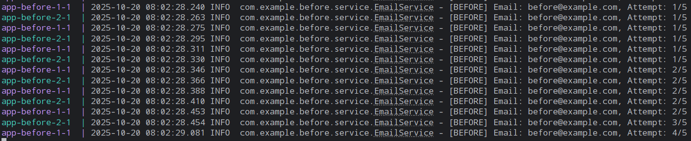

# 레디스는 싱글스레드인데 왜 동시성 제어가 필요할까?

[프로젝트 GitHub](https://github.com/KKangHHee/redis-concurrency-test)

Redis는 **싱글 스레드 기반**으로 동작합니다.  
그런데 Redis를 사용할 때 **동시성 제어** 이야기가 나오는 걸 보고 의문이 생겼습니다.

<!-- truncate -->

> "싱글 스레드인데, 왜 Race Condition이 생기지?"

이 글에서는 이전 프로젝트에서 발견한 의문점을 바탕으로  
✔ Redis의 싱글 스레드 구조  
✔ 동시성 문제가 발생하는 근본 원인  
✔ Docker Compose로 검증한 Before/After 비교  
✔ 안전하게 사용하는 방법을 기록합니다.

---

## 1. Redis란 무엇인가?

Redis(Remote Dictionary Server)는 **메모리 기반 Key-Value 저장소**입니다.

### ✔ 핵심 특징

| 특징            | 설명                                            |
| --------------- | ----------------------------------------------- |
| In-Memory       | RAM 기반으로 디스크보다 매우 빠름               |
| Key-Value 구조  | 단순한 데이터 모델로 빠른 접근                  |
| 싱글 스레드     | 이벤트 루프 기반으로 한 번에 하나의 명령만 처리 |
| 다양한 자료구조 | String, Hash, List, Set, Sorted Set 등 지원     |

### ✔ 주요 사용처

- **캐시**: DB 부하 감소 (조회 성능 향상)
- **세션 관리**: 로그인 상태 유지
- **인증 코드**: 이메일/SMS 인증번호 저장
- **실시간 카운팅**: 조회수, 좋아요 등

---

## 2. Redis의 싱글 스레드 모델

### ✔ Redis 내부 동작 방식

```text
┌─────────────┐
│ Client A    │───┐
└─────────────┘   │
                  ▼
┌─────────────┐   ┌──────────────────┐
│ Client B    │─▶│  Command Queue   │
└─────────────┘   └──────────────────┘
                          │
┌─────────────┐           ▼
│ Client C    │───▶┌──────────────┐
└─────────────┘     │ Event Loop   │ ← 싱글 스레드
                    │ (한 번에 1개) │
                    └──────────────┘
```

> 내부적으로 이벤트 루프 기반 싱글 스레드로, 명령을 처리

1. 클라이언트 요청이 큐에 쌓임
2. Redis는 한 번에 하나의 명령만 처리(각 명령은 원자적)

→ 따라서 `INCR`, `HINCRBY` 같은 **단일 명령**이 중요

## 3. 그럼 왜 동시성 문제가 생길까?

### 문제: "애플리케이션 레벨의 분리된 연산"

Redis 자체는 싱글 스레드이므로 각 명령은 원자적으로 처리됩니다.
하지만 **비즈니스 로직이 GET → Application 계산 → SET 순서로 분리**되어 있다면, 이 사이에는 다른 서버의 요청이 끼어들 수 있는 **Race Window가 발생**합니다.

- 비교 프로젝트를 통해 알아보도록 하겠습니다.
- 환경은 이메일을 키로 하여, 동일 환경에서 Read-Modify-Write와 HINCRBY와 같은 단일 처리로 나눠서 비교하였습니다.

#### 잘못된 구조 (Before)

```java
GET count
+1
SET count
```

- 여러 서버 인스턴스가 동시에 실행되면
- 같은 키의 값을 바꾼다 할때,



> Docker Compose로 **2대 서버 + 12번 병렬 요청**을 보냈을 때: Lost Update 발생

- Redis는 싱글 스레드지만 애플리케이션은 멀티 인스턴스
- 그래서 **RMW** 구조는 **Lost Update** 문제 발생 가능

### 해결: Redis 원자 연산 사용

#### Redis의 원자 연산 명령

| 명령어            | 용도                    | 예시                    |
| ----------------- | ----------------------- | ----------------------- |
| `INCR` / `INCRBY` | 숫자 증가               | 조회수, 좋아요 카운트   |
| `HINCRBY`         | Hash 내부 값 증가       | 사용자별 시도 횟수 관리 |
| `SETNX`           | 최초 1회만 설정         | 분산 락 구현            |
| `Lua Script`      | 여러 명령을 하나로 묶음 | 복잡한 조건부 로직      |

#### 선택 기준

```
단순 증가만 필요 → INCR / INCRBY
여러 항목 관리 → HINCRBY (Hash 구조)
조건부 복잡 로직 → Lua Script
```

#### 해결 구조 (after)

```java
        Long currentAttempts = redisTemplate.opsForHash().increment(key, "attemptCount", 1);
```

- Redis 내부에서 단일 명령으로 처리:
  HINCRBY email:attempts user@example.com 1


> Docker Compose로 **2대 서버 + 12번 병렬 요청**을 보냈을 때: 정확한 카운팅

- **단일 명령**이므로 Redis의 싱글 스레드 특성상 절대 중간에 끼어들 수 없음
- 분산 환경(여러 서버)에서도 안전

## 4. 정리

| 항목     | 내용                                                                        |
| -------- | --------------------------------------------------------------------------- |
| **문제** | Redis는 싱글 스레드지만, 애플리케이션의 분리된 연산에서 Race Condition 발생 |
| **원인** | Read-Modify-Write은 3단계가 분리되어 있음                                   |
| **해결** | HINCRBY 같은 원자 연산 사용                                                 |
| **검증** | Docker Compose로 2대 서버 환경에서 12번 요청 테스트 완료                    |

- Redis를 사용한다고 해서 자동으로 동시성 문제가 해결되는 건 아닙니다.
- Read-Modify-Write 방식으로 구현하면 여전히 Race Condition이 발생할 수 있습니다.
- 트랜잭션 처리처럼 잘 묶어서 올바르게 사용하는 게 중요합니다.
