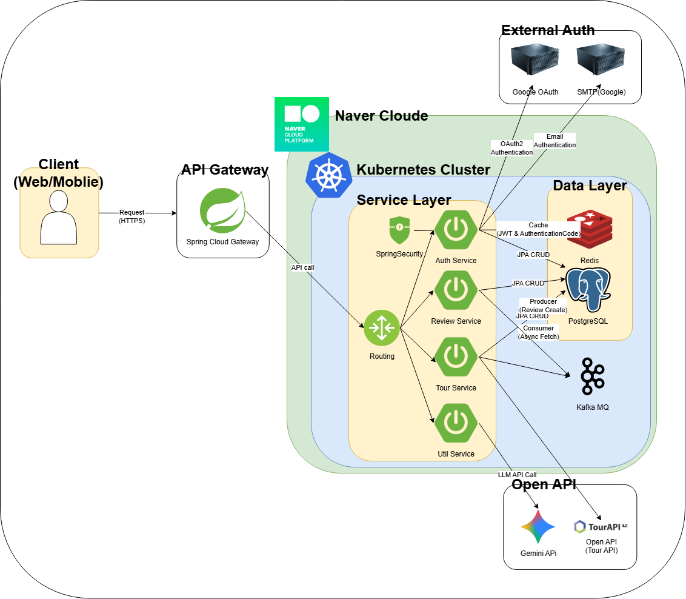
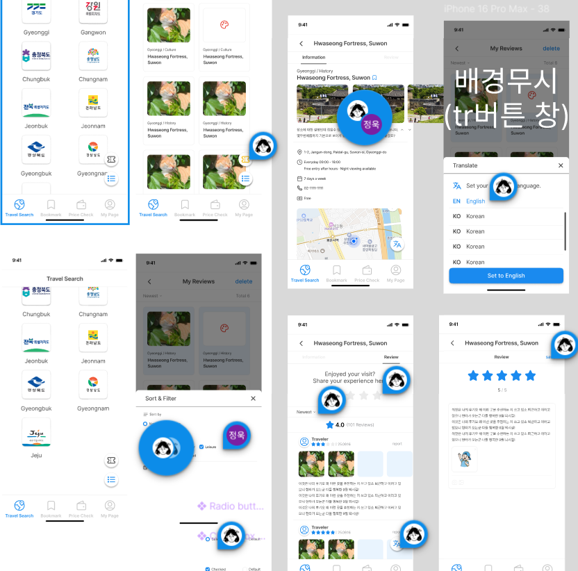

# 🗺️ Bargain Hunter

> **MSA 기반 여행 탐색 플랫폼**  
> 전국의 관광지, 문화명소를 지도로 탐색하고, 리뷰를 남기며, LLM 기반 가격 비교까지 가능한 서비스

---

### 목차

1. [프로젝트 개요](#-프로젝트-개요)
2. [시스템 아키텍처](#system-architecture)
3. [기술 스택](#-기술-스택)
4. [담당 역할](#-담당-역할-auth)
5. [핵심 기술 도전](#-핵심-기술-도전)
6. [주요 성과](#-주요-성과)
7. [배운 점](#-배운-점)
8. [관련 링크](#-관련-링크)

---

## 📋 프로젝트 개요

| 항목        | 내용                                  |
| ----------- | ------------------------------------- |
| **기간**    | 2025.07 ~ 2025.10 (4개월)             |
| **팀 구성** | BE 4명, FE 1명                        |
| **역할**    | Backend Developer (Auth Service 담당) |
| **배포**    | Kubernetes + GitHub Actions CI/CD     |

### 주요 기능

- 🗺️ **지도 탐색**: TourAPI 연동 관광지 정보 제공
- 📝 **리뷰 시스템**: Kafka 기반 이벤트 메시징
- 💬 **가격 질의**: Gemini API 챗봇

---

## 🏗️ 시스템 아키텍처 {#system-architecture}

### 백엔드 구조



### 서비스 구조

  <div
    style={{
      display: "grid",
      gridTemplateColumns: "1fr 1fr",
      gap: "16px",
      height: "100%",
    }}
  >
```text
// 디렉토리 구조
├─ gateway/  # API Gateway
├─ auth/     # 인증 및 사용자 관리 서비스
├─ review/   # 리뷰 서비스
├─ tour/     # 관광지 정보 서비스
└─ util/     # LLM 서비스
````

```text
// 인증 구조
┌─────────────────────────────────────────┐
│         API Gateway (Spring Cloud)      │
│  - JWT 검증 (1회)                        │
│  - 헤더로 사용자 정보 전달                │
└───────────┬─────────────────────────────┘
            │
    ┌───────┴────────┬──────────┬─────────┐
    │                │          │         │
┌───▼───┐    ┌──────▼─────┐  ┌─▼────┐  ┌─▼───┐
│ Auth  │    │  Review    │  │ Tour │  │ Util│
│ (JWT) │    │  (Kafka)   │  │ (API)│  │(LLM)│
└───────┘    └────────────┘  └──────┘  └─────┘
     │              │
┌────▼────┐   ┌────▼────┐
│PostgreSQL│   │PostgreSQL│
└─────────┘   └─────────┘
```

</div>

- **핵심 설계 원칙**
  - **Gateway 중앙 인증**: JWT 검증을 Gateway에서 1회만 수행 → 각 서비스는 헤더에서 사용자 정보 추출
  - **이벤트 기반 비동기**: Spring Event + @Async로 이메일 발송 처리
  - **독립적 배포**: 각 서비스별 Docker 이미지 빌드 → Kubernetes 배포

### figma



---

## 🔧 기술 스택

### Backend

| 기술                          | 선택 이유                          |
| ----------------------------- | ---------------------------------- |
| **Java 17 + Spring Boot 3.x** | 최신 LTS 기반 안정성 확보          |
| **Spring Cloud Gateway**      | Reactive 기반 고성능 API Gateway   |
| **PostgreSQL**                | JSONB 지원 및 복잡한 쿼리 처리     |
| **Redis**                     | 이메일 인증 코드 저장 (Hash + TTL) |
| **JWT + Refresh Token**       | Stateless 인증 + 토큰 갱신 구조    |
| **OAuth2 + PKCE**             | Google 로그인 보안 강화            |

### Infra & DevOps

- **Docker + Kubernetes**: 컨테이너 오케스트레이션
- **GitHub Actions**: PR Merge 시 자동 빌드/배포
- **Naver Cloud Platform**: 인프라 호스팅

---

## 🎯 담당 역할 (Auth)

### 1. JWT + Refresh Token 기반 인증 시스템

```java
@Transactional
public TokenPair generateTokens(User user) {
    // 기존 토큰 삭제 (단일 기기 로그인)
    refreshTokenRepository.deleteByUserId(user.getId());

    // 새 토큰 생성
    Token accessToken = jwtTokenProvider.generateAccessToken(...);
    Token refreshToken = jwtTokenProvider.generateRefreshToken(...);

    // Refresh Token DB 저장
    RefreshToken tokenEntity = RefreshToken.create(
        user.getId(),
        refreshToken.getToken(),
        Date.from(refreshToken.getTokenExpiry())
    );
    refreshTokenRepository.save(tokenEntity);

    return new TokenPair(accessToken, refreshToken);
}
```

**핵심 포인트**

- ✅ Access Token (1시간) + Refresh Token (2주) 이중 구조
- ✅ Refresh Token을 DB에 저장 → 로그아웃 시 즉시 삭제 가능
- ✅ 토큰 탈취 시 해당 사용자의 모든 토큰 무효화 가능

### 2. Google OAuth2 + PKCE 플로우

```typescript
// Frontend: code_verifier 생성
const codeVerifier = generateRandomString(43);
const codeChallenge = await sha256(codeVerifier);

// Authorization Code 요청 시 code_challenge 전송
const authUrl = `${GOOGLE_AUTH_URL}?
  code_challenge=${codeChallenge}&
  code_challenge_method=S256&
  ...`;
```

```java
// Backend: Token 교환 시 code_verifier 검증
@Service
public class OAuth2Service {

    public TokenPair processOAuth2Login(String code, String codeVerifier) {
        // Google로부터 토큰 교환
        GoogleTokenResponse tokenResponse =
            oAuth2FeignClient.exchangeToken(code, codeVerifier);

        // 사용자 정보 조회
        GoogleUserInfo userInfo =
            oAuth2FeignClient.getUserInfo(tokenResponse.getAccessToken());

        // 회원 가입 또는 로그인 처리
        User user = userService.findOrCreateUser(userInfo);

        // JWT 토큰 생성
        return generateTokens(user);
    }
}
```

**보안 강화**

- ✅ PKCE 적용으로 **Authorization Code Interception** 공격 방지
- ✅ code_verifier를 알지 못하는 공격자는 토큰 교환 불가

### 3. Redis 기반 이메일 인증 시스템

```java
// Redis Hash 구조로 코드와 시도 횟수 일관성 보장
public void saveCode(String email, String code, VerificationType type) {
    String key = buildKey(email, type);

    Map data = new HashMap<>();
    data.put("code", code);
    data.put("attemptCount", "0");

    stringRedisTemplate.opsForHash().putAll(key, data);
    stringRedisTemplate.expire(key, Duration.ofMinutes(5));
}

// HINCRBY 원자적 연산으로 동시성 문제 해결
public void verifyCode(String email, String inputCode, VerificationType type) {
    String key = buildKey(email, type);

    String savedCode = (String) stringRedisTemplate.opsForHash().get(key, "code");

    if (savedCode.equals(inputCode)) {
        stringRedisTemplate.delete(key);
        return; // 인증 성공
    }

    // 시도 횟수 원자적 증가
    Long newAttemptCount = stringRedisTemplate.opsForHash()
        .increment(key, "attemptCount", 1);

    if (newAttemptCount > 5) {
        stringRedisTemplate.delete(key);
        throw new InvalidCodeException("인증 시도 횟수 초과");
    }

    throw new InvalidCodeException("인증코드 불일치 (남은 시도: " + (5 - newAttemptCount) + "회)");
}
```

**핵심 개선**

- ✅ Hash 구조로 코드와 시도 횟수를 하나의 키로 관리 → 일관성 보장
- ✅ HINCRBY 원자적 연산으로 동시 요청 시에도 정확한 카운팅
- ✅ TTL 자동 만료로 Redis 메모리 효율 향상

### 4. Gateway 라우팅 및 인증 필터

```java
@Component
public class JwtAuthenticationFilter implements GatewayFilter {

    @Override
    public Mono filter(ServerWebExchange exchange, GatewayFilterChain chain) {
        String token = extractToken(exchange.getRequest());

        // JWT 검증 (1회)
        Claims claims = jwtTokenProvider.validateToken(token);

        // 사용자 정보를 헤더에 추가
        ServerHttpRequest modifiedRequest = exchange.getRequest()
            .mutate()
            .header("X-User-Id", claims.getSubject())
            .header("X-User-Email", claims.get("email", String.class))
            .build();

        return chain.filter(exchange.mutate().request(modifiedRequest).build());
    }
}
```

**장점**

- ✅ Gateway에서 JWT 검증을 1회만 수행 → 각 서비스의 인증 오버헤드 제거
- ✅ 헤더로 사용자 정보 전달 → 각 서비스는 헤더에서 추출만

---

## 🔥 핵심 기술 도전

### 1️⃣ 이메일 발송 API 응답 속도 92% 개선[(관련 PR 보기)](https://github.com/JocketDan/jocketdanBackend/pull/34)

**문제**: JavaMailSender.send()가 동기 블로킹 (평균 2~3초 대기)

**해결**: Spring Event + @Async 비동기 처리
| 항목 | Before | After | 개선율 |
| ----------------- | -------- | ---------- | ---------- |
| API 응답 시간 | 2.5초 | 0.2초 | **92% ↓** |
| 동시 처리 가능 수 | 10 req/s | 100+ req/s | **10배 ↑** |

[상세 분석 보기 →](./troubleshooting/email-async)

---

### 2️⃣ Redis HINCRBY로 동시성 문제 해결

**문제**: GET → 검증 → SET 과정에서 Race Condition 발생

**해결**: Redis Hash + HINCRBY 원자적 연산

```java
// AS-IS: Race Condition 발생
int attemptCount = getAttemptCount(email);  // Thread A: 4, Thread B: 4
attemptCount++;                             // Thread A: 5, Thread B: 5 (잘못!)

// TO-BE: 원자적 증가
Long newAttemptCount = redisTemplate.opsForHash()
    .increment(key, "attemptCount", 1);     // Thread A: 5, Thread B: 6 (정확!)
```

[상세 분석 보기 →](./troubleshooting/redis-concurrency)

---

### 3️⃣ Refresh Token 관리 전략

**문제**: JWT의 Stateless 특성상 토큰 탈취 시 대응 어려움

**해결**: Refresh Token을 PostgreSQL에 저장

| 항목                 | Redis 저장         | **DB 저장 (채택)** |
| -------------------- | ------------------ | ------------------ |
| 로그아웃 즉시 무효화 | ❌ (TTL 만료 대기) | ✅ (즉시 삭제)     |
| 로그 추적            | ❌ (휘발성)        | ✅ (영구 저장)     |
| 단일 기기 로그인     | ❌                 | ✅                 |

[상세 분석 보기 →](./troubleshooting/refresh-token)

---

## 📊 주요 성과

### 성능 최적화

- ✅ 이메일 발송 API 응답 속도 **92% 개선** (2.5s → 0.2s)
- ✅ Redis HINCRBY 원자적 연산으로 동시성 제어
- ✅ Gateway 중앙 인증으로 각 서비스의 JWT 파싱 오버헤드 제거

### 보안 강화

- ✅ PKCE 적용으로 OAuth2 Authorization Code Interception 방지
- ✅ Refresh Token DB 저장으로 토큰 탈취 시 즉시 대응
- ✅ Gateway 단일 JWT 검증으로 인증 일관성 확보

### 아키텍처

- ✅ MSA 기반 독립적인 서비스 구조
- ✅ 이벤트 기반 비동기 처리로 시스템 응답성 향상
- ✅ Kubernetes를 활용한 자동 배포 및 스케일링

---

## 💡 배운 점

### MSA 설계 경험

- 서비스 간 통신 및 데이터 일관성 관리
- Gateway를 통한 인증 정보 전달 방법
- 독립적인 서비스 배포 및 버전 관리

### 보안 중심 설계

- OAuth2 + PKCE 플로우의 이해와 구현
- JWT + Refresh Token 관리 전략
- CSRF/XSS 대응 방법

### 성능 최적화

- 이벤트 기반 비동기 처리의 효과
- Redis를 활용한 동시성 제어
- ThreadPoolTaskExecutor 설정 및 튜닝

---

## 🔗 관련 링크

- [GitHub Repository](https://github.com/JocketDan/jocketdanBackend)
