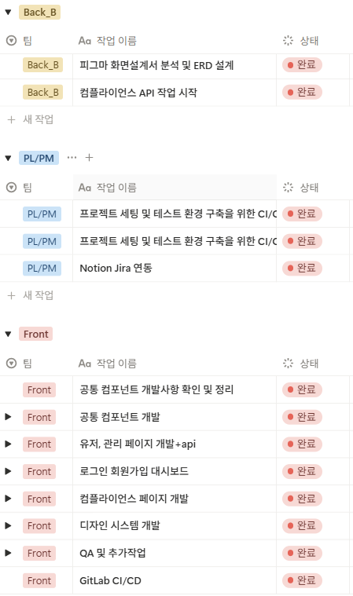

# 🔐 Security Ticket Platform

> **컴플라이언스(ISMS-P, ISO27001) 점검을 디지털화한 웹 기반 관리 플랫폼**  
> Excel·이메일 중심의 수동 프로세스 → 웹 기반 자동화 전환

---

## 📋 프로젝트 개요

| 항목        | 내용                                  |
| ----------- | ------------------------------------- |
| **기간**    | 2025.04 ~ 2025.05 (2개월)             |
| **팀 구성** | BE 8명 (A팀 4명, B팀 4명), FE 3명     |
| **역할**    | Backend Developer (B팀)               |
| **기여도**  | 15% (사용자 관리 담당)                |
| **배포**    | 폐쇄망 온프레미스 + Nexus 패키지 관리 |

### 핵심 문제 인식

기존 정보보호 컴플라이언스 점검은 **Excel 문서와 이메일 기반의 수동 프로세스**로 운영:

- ❌ 점검 이력 관리 및 추적의 어려움
- ❌ 진행 상태에 대한 실시간 파악 불가
- ❌ 역할(관리자/고객사) 기반 접근 제어 미흡
- ❌ 반복적인 커뮤니케이션으로 인한 업무 비효율

### 해결 방향

- ✅ 검증 프로세스의 웹 기반 표준화
- ✅ 역할 기반 권한 관리 및 접근 제어
- ✅ 점검 상태 시각화 및 자동 알림 제공
- ✅ 반복 업무 최소화를 위한 템플릿 기반 검증 흐름

---

## 🏗️ 시스템 아키텍처

### ERD


### Flow chart


### 백엔드 구조


- **배포 환경 특징**

  - 폐쇄망 기반 온프레미스 + Nexus로 패키지 관리
  - Admin: 내부망 직접 접속
  - Customer: EC2 FE → VPN → 내부망 API 접근 구조

- **핵심 설계 원칙**

  - **하이브리드 ORM**: JPA(CRUD) + MyBatis(복잡 검색)
  - **세션 기반 인증**: Spring Security 커스텀 구현
  - **역할 기반 접근 제어**: 최고 관리자 / 관리자 / 고객사

---

## 🔧 기술 스택

### Backend

| 기술                          | 선택 이유                     |
| ----------------------------- | ----------------------------- |
| **Java 17 + Spring Boot 3.x** | 최신 LTS 기반 안정성 확보     |
| **JPA (Hibernate)**           | 단순 CRUD 및 도메인 중심 개발 |
| **MyBatis**                   | 복잡한 검색 조건 및 성능 튜닝 |
| **MySQL**                     | 관계형 데이터 구조에 적합     |
| **Redis**                     | 세션 관리 및 캐시 처리        |
| **Spring Security**           | 세션 기반 인증/인가           |

### Frontend

- **React + TypeScript**: 타입 안정성 확보
- **Tailwind CSS**: 빠른 UI 구성
- **React Query**: 서버 상태 관리

---

## 🎯 담당 역할

### 1. 세션 기반 커스텀 인증/인가 구조 설계

**요구사항**

- JSON 기반 로그인 (표준 FormLogin 필터 사용 불가)
- 계정 잠금, 실패 횟수 증가, 첫 로그인 체크 등 비즈니스 로직 통합
- Admin/Customer 타입별 다른 응답 포맷

**해결**: Controller + Service 레이어에서 Spring Security 플로우 직접 제어

```java
@Service
public class LoginService {

    private void performSecurityAuthentication(
        LoginDto req,
        User user,
        HttpServletRequest request,
        HttpServletResponse response
    ) {
        // 1. AuthenticationManager를 통한 인증
        Authentication authentication = authenticationManager.authenticate(authToken);

        // 2. SessionAuthenticationStrategy 호출 (세션 정책 적용)
        sessionAuthenticationStrategy.onAuthentication(authentication, request, response);

        // 3. SecurityContext 생성 및 설정
        SecurityContext context = securityContextHolderStrategy.createEmptyContext();
        context.setAuthentication(authentication);
        SecurityContextHolder.setContext(context);

        // 4. SecurityContextRepository에 저장
        securityContextRepository.saveContext(context, request, response);
    }
}
```

**핵심 포인트**

- ✅ `SessionAuthenticationStrategy`를 수동 호출하여 세션 정책 적용
- ✅ 중복 로그인 제어 + 세션 고정 공격 방지 + SessionRegistry 등록
- ✅ 비즈니스 로직을 서비스 레이어에서 유연하게 처리

[상세 구현 과정 보기 →](./troubleshooting/custom-session-auth)

---

### 2. 복잡한 검색 기능 성능 최적화 (MyBatis 도입)

**요구사항**

- 다양한 필터링 조건 (기간, 키워드 6종, 정렬)
- 번호 기반 페이지네이션

**문제점**

- JPA Specification으로 구현 시:
  - Java 코드와 SQL 로직 혼재 → 가독성 저하
  - 동적 조건 추가 시 코드 복잡도 증가
  - 쿼리 튜닝 어려움

**해결**: MyBatis 동적 SQL + EXISTS 서브쿼리 패턴

```xml
  SELECT u.*, c.*, co.*
  FROM user u
  LEFT JOIN client c ON u.client_id = c.client_id
  LEFT JOIN company co ON c.company_id = co.company_id
  WHERE u.client_id IS NOT NULL

    AND (
      (#{range} = 'all' AND (
        u.email LIKE CONCAT('%', #{keyword}, '%')
        OR u.name LIKE CONCAT('%', #{keyword}, '%')
      ))
      OR (#{range} = 'email' AND u.email LIKE CONCAT('%', #{keyword}, '%'))
      OR (#{range} = 'name' AND u.name LIKE CONCAT('%', #{keyword}, '%'))
    )


  ORDER BY u.last_login_at DESC
  LIMIT #{limit} OFFSET #{offset}

  SELECT COUNT(*)
  FROM user u
  WHERE u.client_id IS NOT NULL

    AND (
      u.email LIKE CONCAT('%', #{keyword}, '%')
      OR EXISTS (
        SELECT 1 FROM client c
        WHERE c.client_id = u.client_id
        AND c.phone_number LIKE CONCAT('%', #{keyword}, '%')
      )
    )
```

**핵심 개선**

1. **동적 SQL 최적화**

   - `<choose>` 중첩 제거 → OR 조건 기반 통합
   - 쿼리 템플릿 고정화 → SQL 캐시 효율 향상

2. **COUNT 쿼리 최적화**
   - `JOIN` 후 `COUNT(*)` → `EXISTS` 서브쿼리
   - 불필요한 조인 제거 + 조기 종료 가능

[상세 성능 분석 보기 →](./troubleshooting/mybatis-optimization)

---

## 🔥 핵심 기술 도전

### 1️⃣ 복합 검색 성능 36% 개선

**문제**: JPA Specification 사용 시 복잡한 조건에서 성능 저하

**해결**: MyBatis 동적 SQL + EXISTS 패턴

<div
  style={{
    display: "grid",
    gridTemplateColumns: "1fr 1fr",
    gap: "16px",
  }}
>
  <div></div>
  <div>
    <table style={{ width: "100%", fontSize: "14px" }}>
      <thead>
        <tr>
          <th>항목</th>
          <th>JPA Specification</th>
          <th>MyBatis (최종)</th>
          <th>개선율</th>
        </tr>
      </thead>
      <tbody>
        <tr>
          <td>
            <strong>평균 응답시간</strong>
          </td>
          <td>24.45ms</td>
          <td>15.51ms</td>
          <td>
            <strong>36.8% ↓</strong>
          </td>
        </tr>
        <tr>
          <td>
            <strong>최대 응답시간</strong>
          </td>
          <td>83.67ms</td>
          <td>54ms</td>
          <td>
            <strong>35% ↓</strong>
          </td>
        </tr>
        <tr>
          <td>
            <strong>처리량 (TPS)</strong>
          </td>
          <td>221.77</td>
          <td>273.34</td>
          <td>
            <strong>23% ↑</strong>
          </td>
        </tr>
      </tbody>
    </table>
  </div>
</div>

**MyBatis 개선 전 대비**

- 최대 응답시간 **88.5% 감소** (473ms → 54ms)
- 처리량 **3.9배 증가** (66.7 → 273 TPS)

[상세 분석 보기 →](./troubleshooting/mybatis-optimization)

---

### 2️⃣ 커스텀 세션 인증 구현

**문제**: 표준 FormLogin으로 처리 어려운 비즈니스 로직

- 계정 잠금, 실패 횟수, 첫 로그인 체크
- Admin/Customer 타입별 커스텀 응답

**해결**: Controller + SessionAuthenticationStrategy 조합

**인증 플로우**

```
Client Request
    ↓
Controller (요청 수신)
    ↓
LoginService (비즈니스 검증)
  ├─ 사용자 확인
  ├─ 계정 활성 여부
  ├─ 비밀번호 검증
  └─ 첫 로그인 검증
    ↓
performSecurityAuthentication
  ├─ AuthenticationManager.authenticate()
  ├─ SessionAuthenticationStrategy.onAuthentication()
  │   ├─ 중복 세션 제어
  │   ├─ 세션 고정 공격 방지
  │   └─ SessionRegistry 등록
  ├─ SecurityContext 생성
  └─ HttpSession에 저장
    ↓
Response
```

[상세 구현 과정 보기 →](./troubleshooting/custom-session-auth)

---

## 📊 주요 성과

### 성능 개선

- ✅ 복합 검색 **평균 응답시간 36% 개선** (24.45ms → 15.51ms)
- ✅ EXISTS 서브쿼리로 **최대 응답시간 88.5% 감소** (473ms → 54ms)
- ✅ 쿼리 구조 단순화로 **처리량 3.9배 증가** (66.7 → 273 TPS)

### 보안 강화

- ✅ 세션 기반 커스텀 인증으로 비즈니스 로직 통합
- ✅ 계정 잠금, 실패 횟수, 첫 로그인 체크 등 보안 요구사항 충족
- ✅ `SessionRegistry`를 활용한 활성 세션 관리

### 협업 효율성

- ✅ API 표준화로 FE 연동 시간 **30% 단축** (팀 피드백 기반)
- ✅ Swagger 문서 자동화로 커뮤니케이션 비용 감소
  
  <div
    style={{
      display: "grid",
      gridTemplateColumns: "1fr 1fr",
      gap: "16px",
      height: "100%",
    }}
  >
    <div>
      
      <br />
      
    </div>
    <div></div>
  </div>

---

## 💡 배운 점

### 1. 기술 선택은 "문제 해결" 중심

- JPA가 항상 최선은 아니라는 점을 경험
- **문제 성격에 맞는 기술 선택의 중요성** 체감
- 복잡한 조회 로직에서는 SQL 중심 접근이 더 효율적

### 2. 성능 문제는 구조에서 시작

- 단순한 쿼리 튜닝보다:
  - 도메인 설계
  - 조회 책임 분리
  - 적절한 계층화
- 이러한 구조적 접근이 성능 개선의 핵심

### 3. Spring Security 내부 동작 이해

- 표준 필터 체인을 벗어나 커스텀 인증 구현 경험
- `SessionAuthenticationStrategy`, `SecurityContextRepository` 등  
  핵심 컴포넌트의 역할과 연계 방식 이해
