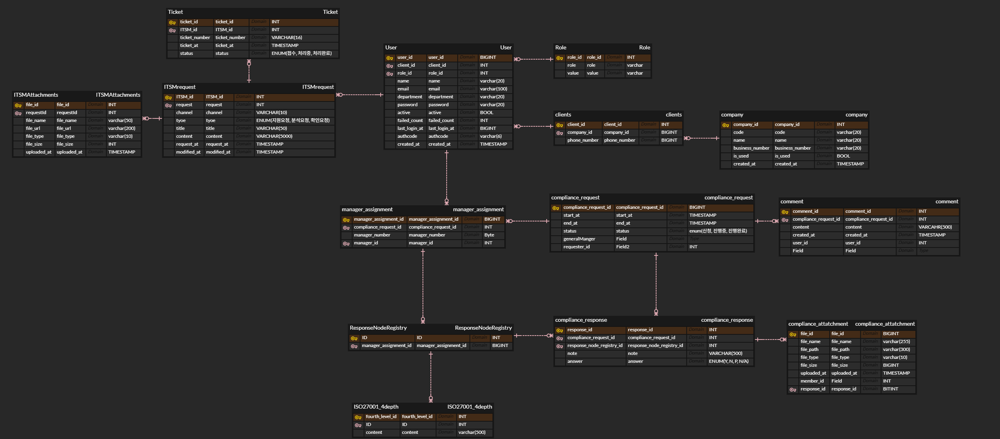
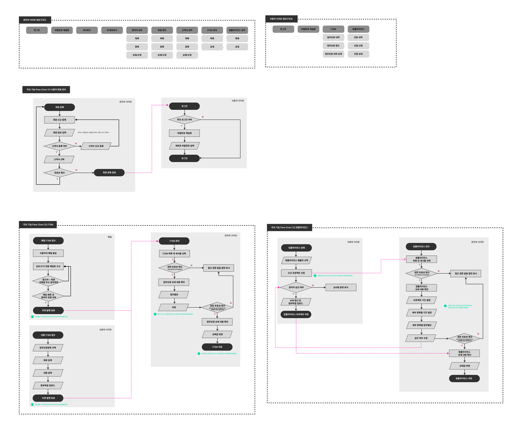
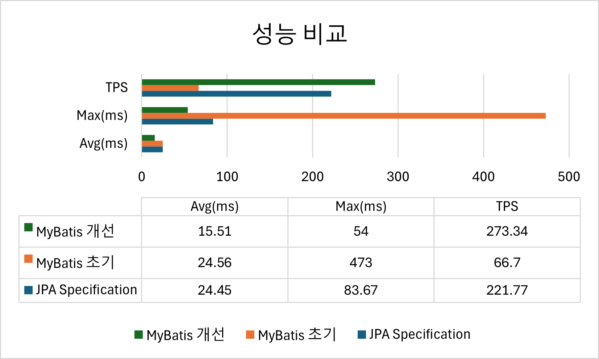
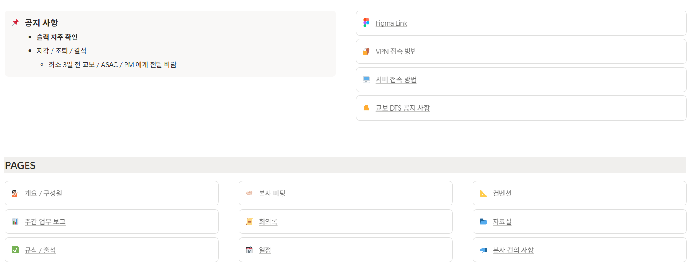
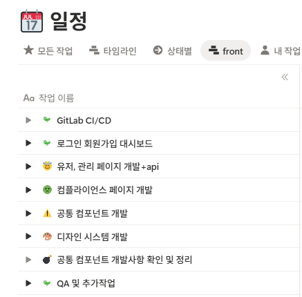
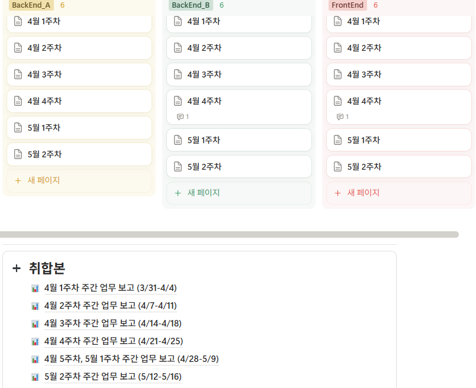
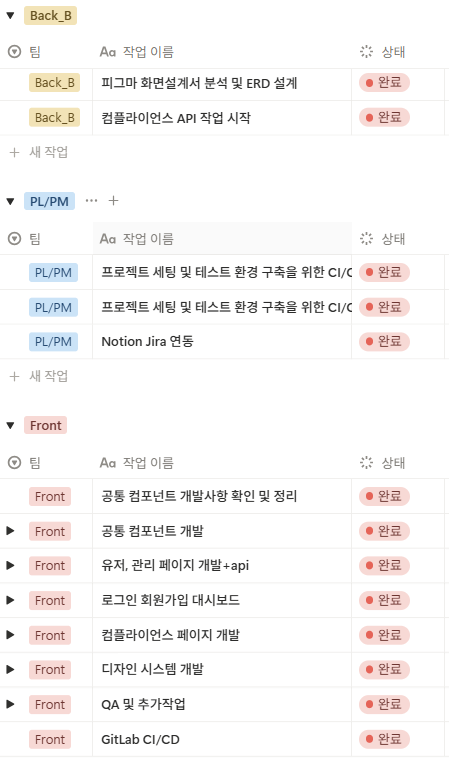

# 🔐 Security Ticket

> **컴플라이언스(ISMS-P, ISO27001) 점검을 디지털화한 웹 기반 관리 플랫폼**  
> Excel·이메일 중심의 수동 프로세스 → 웹 기반 자동화 전환

---

## 📋 프로젝트 개요

| 항목        | 내용                                  |
| ----------- | ------------------------------------- |
| **기간**    | 2025.04 ~ 2025.05 (2개월)             |
| **팀 구성** | BE 8명 (A팀 4명, B팀 4명), FE 3명     |
| **역할**    | 사용자 관리 도메인 및 백엔드 API 설계 |
| **배포**    | 폐쇄망 온프레미스 + Nexus 패키지 관리 |

### 핵심 문제 인식

기존 정보보호 컴플라이언스 점검은 **Excel 문서와 이메일 기반의 수동 프로세스**로 운영:

- ❌ 점검 이력 관리 및 추적의 어려움
- ❌ 진행 상태에 대한 실시간 파악 불가
- ❌ 역할(관리자/고객사) 기반 접근 제어 미흡
- ❌ 반복적인 커뮤니케이션으로 인한 업무 비효율

### 해결 방향

- ✅ 검증 프로세스의 웹 기반 표준화
- ✅ 역할 기반 권한 관리 및 접근 제어
- ✅ 점검 상태 시각화 및 자동 알림 제공
- ✅ 반복 업무 최소화를 위한 템플릿 기반 검증 흐름

---

## 🏗️ 시스템 아키텍처

### ERD



### Flow chart



### 백엔드 구조


- **배포 환경 특징**
  - 폐쇄망 기반 온프레미스 + Nexus로 패키지 관리
  - Admin: 내부망 직접 접속
  - Customer: EC2 FE → VPN → 내부망 API 접근 구조

- **핵심 설계 원칙**
  - **하이브리드 ORM**: JPA(CRUD) + MyBatis(복잡 검색)

---

## 🔧 기술 스택

### Backend

| 기술                   | 선택 이유                     |
| ---------------------- | ----------------------------- |
| **Java + Spring Boot** | 프로젝트 표준 기술 스택       |
| **JPA (Hibernate)**    | 단순 CRUD 및 도메인 중심 개발 |
| **MyBatis**            | 복잡한 검색 조건 및 성능 튜닝 |
| **MySQL**              | 관계형 데이터 구조에 적합     |
| **Redis**              | 세션 관리 및 캐시 처리        |

### Frontend

- **React + TypeScript**: 타입 안정성 확보
- **Tailwind CSS**: 빠른 UI 구성
- **React Query**: 서버 상태 관리

---

## 🎯 담당 역할

### 1. 복합 조회 분리와 COUNT 쿼리 구조 개선

**요구사항**

- 다양한 필터링 조건 (기간, 키워드 6종, 정렬)
- 번호 기반 페이지네이션

**문제점**

- JPA Specification으로 구현 시:
  - Java 코드와 SQL 로직 혼재 → 가독성 저하
  - 동적 조건 추가 시 코드 복잡도 증가
  - 쿼리 튜닝 어려움

**해결**: 복합 조회를 MyBatis로 분리하고 COUNT 쿼리의 불필요한 JOIN을 EXISTS로 재구성

```xml
  SELECT u.*, c.*, co.*
  FROM user u
  LEFT JOIN client c ON u.client_id = c.client_id
  LEFT JOIN company co ON c.company_id = co.company_id
  WHERE u.client_id IS NOT NULL

    AND (
      (#{range} = 'all' AND (
        u.email LIKE CONCAT('%', #{keyword}, '%')
        OR u.name LIKE CONCAT('%', #{keyword}, '%')
      ))
      OR (#{range} = 'email' AND u.email LIKE CONCAT('%', #{keyword}, '%'))
      OR (#{range} = 'name' AND u.name LIKE CONCAT('%', #{keyword}, '%'))
    )


  ORDER BY u.last_login_at DESC
  LIMIT #{limit} OFFSET #{offset}

  SELECT COUNT(*)
  FROM user u
  WHERE u.client_id IS NOT NULL

    AND (
      u.email LIKE CONCAT('%', #{keyword}, '%')
      OR EXISTS (
        SELECT 1 FROM client c
        WHERE c.client_id = u.client_id
        AND c.phone_number LIKE CONCAT('%', #{keyword}, '%')
      )
    )
```

**핵심 개선**

1. **동적 SQL 최적화**
   - `<choose>` 중첩 제거 → OR 조건 기반 통합
   - 조건 분기를 단순화해 매퍼 가독성과 수정 범위 개선

2. **COUNT 쿼리 최적화**
   - `JOIN` 후 `COUNT(*)` → `EXISTS` 서브쿼리
   - 불필요한 조인 제거 + 조기 종료 가능

[상세 성능 분석 보기 →](./troubleshooting/mybatis-optimization)

---

## 🔥 핵심 기술 도전

### 1️⃣ 복합 검색 쿼리 구조 개선

**문제**: JPA Specification 사용 시 복잡한 조건에서 성능 저하

**해결**: MyBatis 동적 SQL + EXISTS 패턴

<div
  style={{
    display: "grid",
    gridTemplateColumns: "1fr 1fr",
    gap: "16px",
  }}
>
  <div>
    
  </div>
  <div>
    <table style={{ width: "100%", fontSize: "14px" }}>
      <thead>
        <tr>
          <th>항목</th>
          <th>JPA Specification</th>
          <th>MyBatis (최종)</th>
          <th>개선율</th>
        </tr>
      </thead>
      <tbody>
        <tr>
          <td>
            <strong>평균 응답시간</strong>
          </td>
          <td>24.45ms</td>
          <td>16.85ms</td>
          <td>
            <strong>31.1% ↓</strong>
          </td>
        </tr>
      </tbody>
    </table>
  </div>
</div>

> 로컬 환경에서 동시 사용자 10명, 각 50회 요청으로 측정했으며 동일한 데이터와 인덱스 조건을 유지했습니다.

[상세 분석 보기 →](./troubleshooting/mybatis-optimization)

---

## 📊 주요 성과

### 성능 개선

- ✅ 복합 검색 쿼리 구조 개선 (동일한 로컬 테스트 조건에서 평균 24.45ms → 16.85ms)

### 협업 효율성

- ✅ 공통 응답 형식과 Swagger 문서를 정리해 프론트엔드 연동 기준 통일
  
  <div
    style={{
      display: "grid",
      gridTemplateColumns: "1fr 1fr",
      gap: "16px",
      height: "100%",
    }}
  >
    <div>
      
      <br />
      
    </div>
    <div>
      
    </div>
  </div>

---

## 💡 배운 점

### 1. 기술 선택은 "문제 해결" 중심

- JPA가 항상 최선은 아니라는 점을 경험
- **문제 성격에 맞는 기술 선택의 중요성** 체감
- 복잡한 조회 로직에서는 SQL 중심 접근이 더 효율적

### 2. 성능 문제는 구조에서 시작

- 단순한 쿼리 튜닝보다:
  - 도메인 설계
  - 조회 책임 분리
  - 적절한 계층화
- 이러한 구조적 접근이 성능 개선의 핵심

### 3. 인증 정책과 API 책임 분리

- 로그인 요청 처리와 계정 상태 정책을 서비스 계층에서 구분해 구현한 경험
